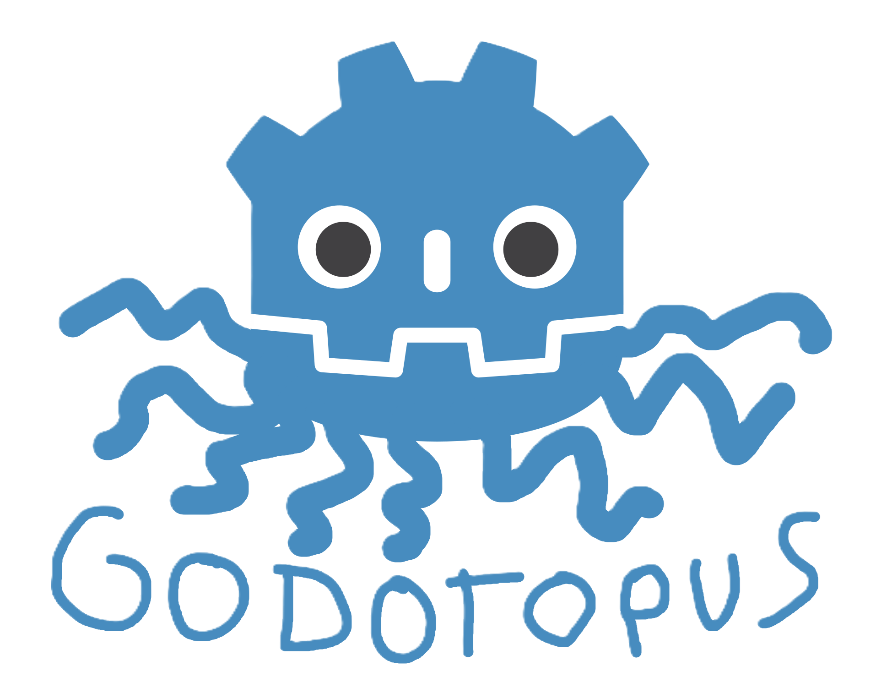

# Godotopus



A simple and usable GDExtension addon that provides VOIP for Godot 4 using Opus encoding and decoding.

> [!WARNING]
> This is a work in progress. It was originally just an internal addon for our games. Anything might end up changing, and there are likely lots of bugs. If you encounter any issues, or are super smart and have a better idea of what's going on than I do, please make an issue on the [GitHub Issues page](https://github.com/Mako-Mako-Games/godotopus/issues).


## Features

* Opus encoding
* Plug-and-play. (as much as possible, anyway)
* Voice activity detection via Opus's DTX for reduced bandwidth usage when no one is talking
* FEC (forward error correction) for recovering short burst packet loss
* Opus Bandwidth Extension for recreating high frequencies on medium bitrate settings
* Deep Redundancy (DRED) for recovering much longer packet loss bursts
* Network jitter compensation
* Config synchronization between peers
* Easy configuration
* Output to multiple audio players (great for radios or clever effects!)
* Supports all `AudioStreamPlayer` node types
* Buildable without DDN-based features for much smaller compiled sizes


## Future Improvements

* Microphone pre-processing effects (noise suppression, AGC, etc.)
* Better networking solution than base RPC
* Port all scripts to C++ (maybe...)
* Code quality improvements (there's a lot of spaghetti in here)
* Squeeze as much latency out of the system as possible
* Clearer name???


---

## Installation

1. Download the latest release for your platform.
2. Extract it into your project's `addons/` folder.
3. Enable the plugin in **Project Settings → Plugins**.

---

## Usage

Godotopus supports two methods of capturing microphone input:

* **Direct AudioServer Input** (default, recommended) - Pulls mic input
  straight from the `AudioServer`, bypassing Godot's audio bus entirely.
* **Capture Bus** - Routes the microphone through a Godot audio bus first, so
  you can apply bus effects (e.g. a noise gate) to it before encoding.

> [!WARNING]
> The Capture Bus path has a tricky Godot engine issue where it may build up multiply seconds of latency in a way Direct AudioServer Input does not
> exhibit at all. This isn't something I know of a way to work around, and is the reason 
> Direct AudioServer Input exists.
> Only use Capture Bus if you specifically need bus effects on the mic
> signal before it's encoded, and accept that reliability tradeoff.

### Direct AudioServer Input

1. Add a `VoiceTransmitter`.
2. Leave **Capture Bus Name** empty (the default).
3. Assign a `VoiceConfig` resource.
4. Add one or more audio players to the `Players` array.

### Capture Bus

1. Create a new audio bus (for example, `VoiceCapture`).
2. Add an `AudioEffectCapture` effect to that bus.
3. Add an `AudioStreamPlayer` somewhere in your main scene and assign it an `AudioStreamMicrophone`.
4. Add a `VoiceTransmitter`.
5. Set **Capture Bus Name** to the name of the bus you created.
6. Assign a `VoiceConfig` resource (the defaults are fine).
7. Add one or more audio players to the `Players` array.

> **Note**
>
> Make _SURE_ you don't end up creating multiple microphone recording AudioStreamPlayer nodes. I spent 5 hours straight trying to figure out why people's voices were playing back twice, just because I added one under a scene that gets instantiated twice!

---

## Building

Clone the repository with submodules:

```bash
git clone --recursive https://github.com/Mako-Mako-Games/godotopus.git
```

or

```bash
git clone --recursive git@github.com:Mako-Mako-Games/godotopus.git
```

Build from the repository root:

```bash
scons
```

Copy `build/addons/godotopus/` into your project's `addons/` folder.

> You may need to build `third-party/godot-cpp` first:
>
> ```bash
> cd third-party/godot-cpp
> scons
> ```

### Optional: DNN-based features

libopus's deep-learning features need a set of pretrained-weight source files that aren't checked into the
`opus` submodule by default. They largely increase the size of the compiled library, so a version with and without is available. To build with them, use the `dred=yes` flag:

```bash
scons dred=yes
```

---

## About

Godotopus is made by Mako Mako Games.

* Berti - Programmer (me)
* Pockette - UI/UX 
* Sazarn - Artist


We're a group of recent college graduates working on our first long-term Godot game. If you'd like to follow development, check out our YouTube channel.

[](https://www.youtube.com/@MakoMakoDev)

https://www.youtube.com/@MakoMakoDev
